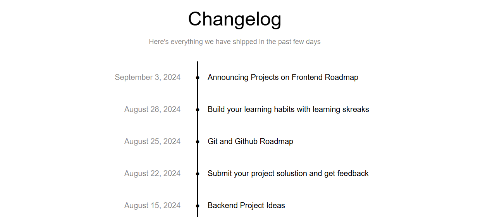

# Changelog Component

## HTML and CSS Changelog component

## Description

- The motivation behind this project was to build something that can help keep track of major changes to a project
- This will help everyone involved in the project know what has already been completed
- While building this projoct, I got a better grasp of how to use grid

## Usage
- Click on the link to got to repository
- Clone repository to local environment
- Launch project to view

## Project URL 
[https://roadmap.sh/projects/changelog-component]